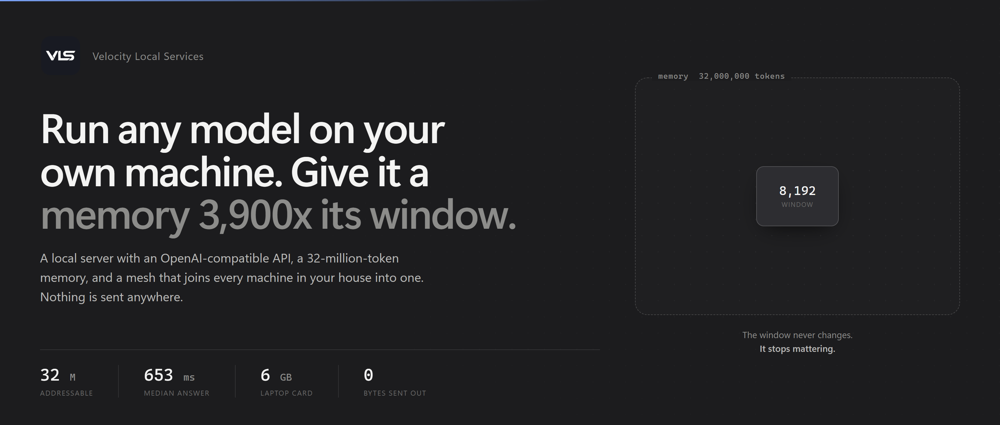
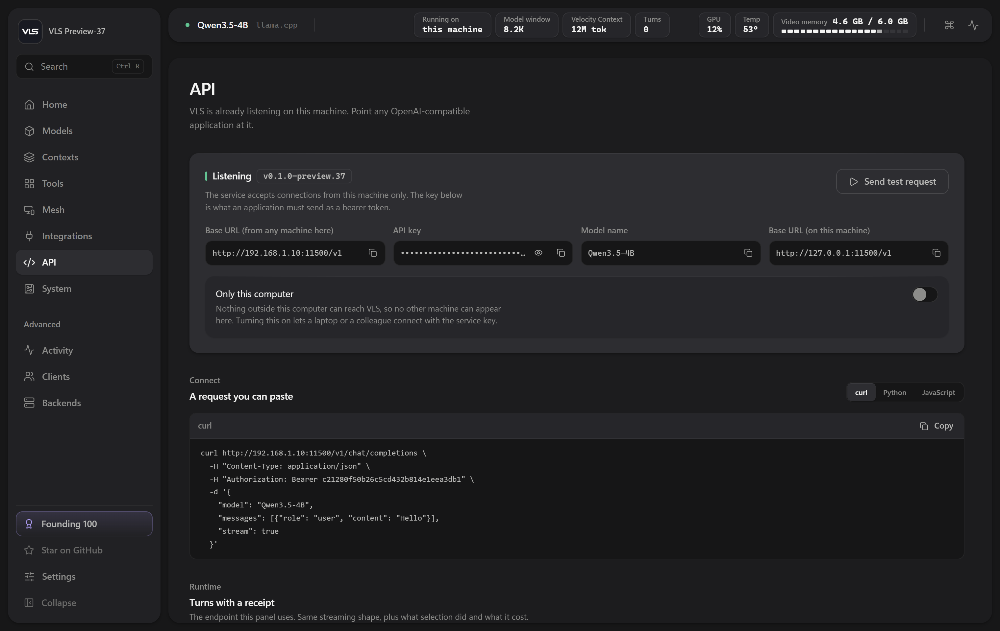
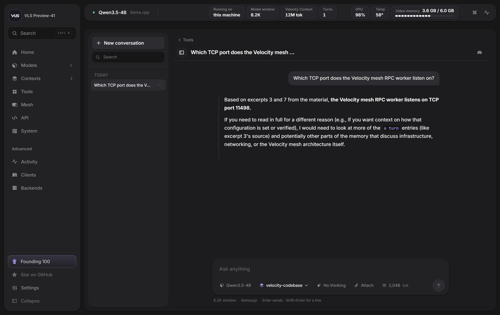
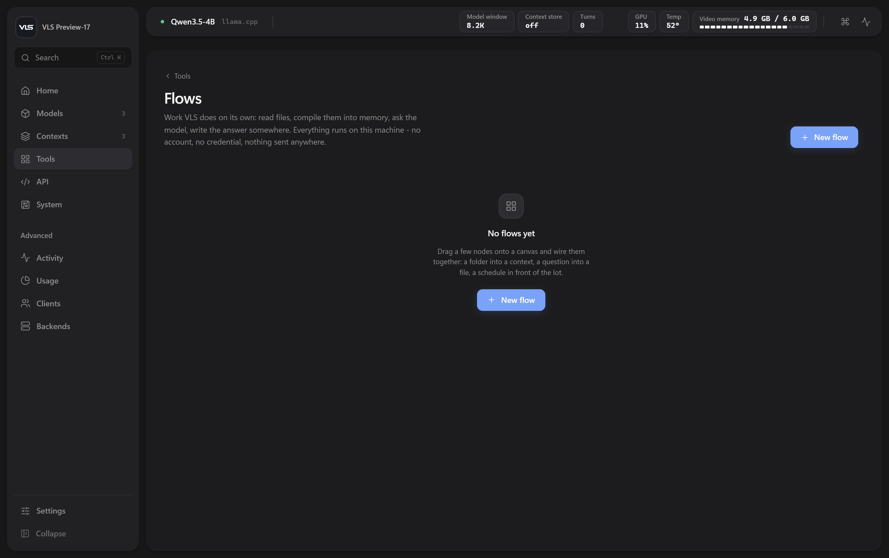
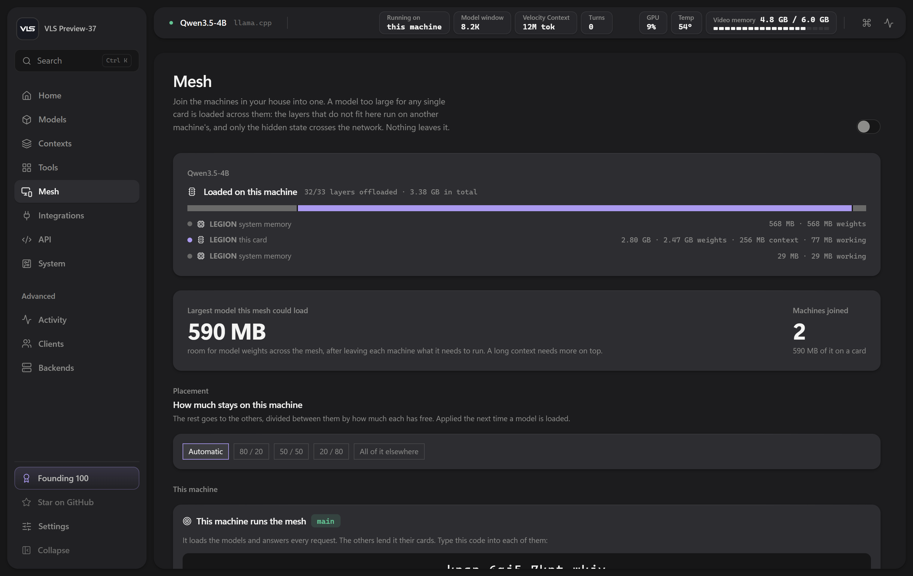

<div align="center">



<br><br>

[](https://github.com/Veloresearch/VLS-32M-Context-Local-LLM/releases/latest)
[](https://github.com/Veloresearch/VLS-32M-Context-Local-LLM/releases)
[](https://github.com/Veloresearch/VLS-32M-Context-Local-LLM)
[](https://github.com/Veloresearch/VLS-32M-Context-Local-LLM)

[](#windows)
[](#linux)
[](LICENSE)

</div>

<br>

<div align="center">

**[Install](#install)** &nbsp;·&nbsp; **[The 32M context](#the-32-million-token-context)** &nbsp;·&nbsp; **[Everything in it](#everything-in-it)** &nbsp;·&nbsp; **[Mesh](#5-mesh--every-machine-in-your-house-as-one)** &nbsp;·&nbsp; **[Benchmarks](#measured-not-claimed)** &nbsp;·&nbsp; **[API](#connect-anything)** &nbsp;·&nbsp; **[FAQ](#questions-people-actually-ask)**

</div>

<br>

---

<a name="install"></a>
## Install

One command. No account, no sign-in, no telemetry, no Docker.

<a name="windows"></a>**Windows**

```powershell
irm https://github.com/Veloresearch/VLS-32M-Context-Local-LLM/releases/latest/download/install.ps1 | iex
```

<a name="linux"></a>**Linux**

```bash
curl -fsSL https://github.com/Veloresearch/VLS-32M-Context-Local-LLM/releases/latest/download/install.sh | sh
```

The installer looks at the machine before it downloads anything and takes the build that suits it —
**CUDA** where there is an NVIDIA card, **Vulkan** on Linux where there is any card at all (NVIDIA,
AMD or Intel), **processor** otherwise. It opens the panel when it is done.

Removing it is deleting one folder. Your models and memories live somewhere else and are never
touched by an install, an update or an uninstall.

<br>

---

## The problem

A model's context window is a hard limit paid for in memory. Eight thousand tokens, thirty-two
thousand, a hundred and twenty-eight — whatever it is, the work you actually have is bigger than
it, and the usual answers are all bad ones:

- **Send less.** Then the model answers about the part you happened to pick.
- **Summarise.** Then the detail you needed is the detail that got summarised away.
- **Build a vector database.** Then you run a second service, embed everything, tune a chunk size,
  and hope the chunks that come back are the right ones. When the answer is wrong you cannot tell
  whether the model failed or the retrieval did.

**VLS gives the model a memory instead of a bigger window.**

You compile a folder once. Every question after that reaches the whole of it: the service works out
which passages the answer needs, hands the model only those, and shows you a receipt of exactly
what it read. The model's window never changes — it stops mattering.

<div align="center">
<br>

<br><br>
</div>

<br>

---

## The 32-million-token context

This is the part worth understanding, because it is not what people assume.

### It is not RAG

There is no embedding model, no vector index, no similarity threshold and no second service. A
context is a **file on your disk** in a documented format, built once, read directly.

Selection works on **rarity in the model's own tokens**. When you ask a question, VLS looks at which
of its words are rare in this particular corpus, finds the windows that hold them, follows names
from those windows to the ones they point at — a second hop, for questions whose answer sits beside
somebody the question never named — and assembles what fits. A single linear pass over token ids
with a hash lookup, which is what makes 32 million affordable without a GPU touching it.

### What it costs

| corpus | one-time build | answer, median | answer, p90 |
|---|---:|---:|---:|
| 1M tokens | 0.5 s | 703 ms | 890 ms |
| 10M tokens | 5.3 s | 570 ms | 1 081 ms |
| 20M tokens | 10.6 s | 708 ms | 1 117 ms |
| **32M tokens** | **17.2 s** | **653 ms** | **1 111 ms** |

Thirty-two times the material, the same half second. A question does not read the corpus; it
reaches into it.

### What you get back

Every answer carries a receipt — not a log you go and find, but part of the response:

- which store answered, and how much of it is addressable
- how many windows were considered, and how many were selected
- **the exact text handed to the model**, if you ask for it
- what selection cost, in milliseconds and in tokens of the window

That receipt is the difference between a system you can debug and one you have to trust. When an
answer is wrong you can see immediately whether the memory failed to deliver the passage or the
model failed to read it — and those two need opposite fixes.

### Where it fills up

A context has a stated capacity. When it is full the write is **refused with a message naming the
limit** and nothing is silently dropped; you give it more room or start another. A memory that
quietly forgets is worse than one that says it is full.

<div align="center">
<br>

<br><br>
</div>

<br>

---

## Everything in it

### 1. A local server that speaks OpenAI



An OpenAI-compatible endpoint on a local address, so anything that already talks to OpenAI talks to
VLS — editors, agents, scripts, your own code. Streaming, tool calls, the usual sampling knobs.

The **API** page shows the address of *this machine on your network*, not `localhost`, next to the
key and a request you can paste. It reports `context_length` as **the model's window** — the most
one request may contain — and reports how far the memory reaches, how much of it is used and what
happens when it fills, as separate fields beside it. Two different numbers, never added together,
because a client that confuses them builds prompts that get trimmed without anybody noticing.

### 2. Models, and whether they fit before you download


Search Hugging Face from inside the panel. VLS reads each build's header, compares it against the
card and memory it found in this machine, and tells you which quantisation will run well **before**
the download starts — rather than after eight gigabytes have arrived.

Downloads keep running when you leave the page, show progress on the Models page and in Activity,
and a half-finished file is **never given a model's name**, so it can never be offered to you as
something loadable. Load and unload from the tile. Point VLS at a folder of GGUFs you already have
and it reads their headers without loading anything.

### 3. Playground, with a receipt for every answer



Talk to the loaded model with a memory attached. A reasoning model's working is shown **as it
happens** rather than behind a spinner, and **thinking is a switch beside the message box**, per
conversation rather than per installation: on for a hard question, off for a lookup. On a short
factual question that is the difference between 4.1 seconds and 0.2.

Each conversation has its own memory, so two chats — or two people — do not overwrite each other.

### 4. Flows — work VLS does on its own



A canvas of nodes joined by wires: read a folder, compile it into memory, ask the model, branch on
the answer, write the result to a file — on a schedule, without you. A wire carries text, the order
comes from the graph, and a loop is refused rather than run.

Everything runs on this machine. No accounts, no OAuth, no webhooks out — and that is a decision,
not a gap. An automation product's value is its four hundred integrations, each with its own review
process and its own breaking change every quarter; and the moment VLS asks for somebody's mail
password it becomes a thing worth attacking. What is here instead is the work only VLS can do,
because only VLS has the memory.

<a name="5-mesh--every-machine-in-your-house-as-one"></a>
### 5. Mesh — every machine in your house as one



The old laptop in the drawer, the box under the desk, the one with the card in it. Switch the mesh
on and they **find each other by themselves** — no addresses to type, no configuration files. One
machine makes a join code, you paste it into the others, and the panel shows what the whole house
has: every machine, its address, which one is in charge, how much memory it brings and how fast it
reads it.

The join code **never travels over your network**. Only a hash of it does, so a machine listening on
your wifi learns that VLS exists and nothing else. A machine that is *found* is listed and asked
nothing until it is *joined*, and the main role can be handed from one machine to another — the new
one takes it before the old one stands down, so the mesh is never left without one.

> **Where it stands.** What ships today is discovery, the pooled view of what your machines have,
> and the placement plan: which device would hold which layers, fastest first, card before system
> memory, so a model too large for any one machine has somewhere to go. Splitting a model across
> machines is measured and works; wiring it into the product is the next piece of work, and until
> that lands the mesh reports and routes rather than splits. We would rather say that here than
> have you find it out after installing.

### 6. Benchmarks you run yourself


Decode speed, time to first token, context retrieval, BABILong-style long context, and your own
prompt — measured on **your** machine with **your** model, kept as a record of runs that actually
happened. Nothing here is a number we shipped; it is a number your computer produced.

### 7. Everything the machine is doing


Card, memory, temperature, what is resident and where it was placed, which backend took the model
and why it was chosen. Usage and client history survive restarts **and updates** — a record that
only lasts until the next release is not a record.

<br>

---

## Measured, not claimed

Everything below ran on one laptop: an **RTX 3060 Laptop, 6 GB**, with **Qwen3.5-4B-Q4_K_M** and an
**8 192-token window**. Read the parts that do not flatter us; they are there on purpose.

### NVIDIA's RULER, on their harness

Cloned, nothing underneath it modified: their generators, their scorer, their prompts.

| RULER task | 4k | 16k | 32k | 64k | 128k |
|---|---:|---:|---:|---:|---:|
| niah_single_1 | 100 | 100 | 100 | 100 | 100 |
| niah_single_2 | 100 | 100 | 100 | 100 | 100 |
| niah_single_3 | 100 | 100 | 100 | 100 | 100 |
| niah_multikey_1 | 100 | 100 | 100 | 100 | 100 |
| niah_multikey_2 | 100 | 20 | 100 | 100 | 100 |
| niah_multikey_3 | 100 | 0 | 40 | 100 | 75.0 |
| niah_multivalue | 100 | 100 | 100 | 100 | 100 |
| niah_multiquery | 100 | 100 | 100 | 100 | 98.8 |
| vt | 100 | 32 | 72 | 60 | 78.0 |
| cwe | 100 | 100 | 100 | 98 | 98.5 |
| fwe | 100 | 100 | 100 | 100 | 100 |
| qa_1 | 100 | 80 | 60 | 60 | 50.0 |
| qa_2 | 100 | 40 | 40 | 40 | 30.0 |
| **13-task average** | **100.0** | **74.8** | **85.5** | **89.1** | **86.9** |

<sub>4k–64k are five samples a cell; 128k is twenty — 260 runs in that column alone.</sub>

The score **rises** from 16k to 64k, which is backwards for a context benchmark and is exactly the
shape this architecture predicts: the model's window is 8 192 tokens at every length, so nothing is
ever "too long to read" — what changes is how much material selection has to choose from. **The 16k
column is the anomaly, not the 128k one**, and we do not yet know why. `qa_2` at 30% is the floor.
At five samples a cell the 128k average reads **89.6**; at twenty it reads **86.9**, and we publish
the second number.

### And beyond, to 32 million

Past 128k NVIDIA's harness stops, so the ladder below is **our own** — same task definitions, our
haystack, our scorer — on the same machine and the same window. The two are reported separately and
never averaged together.

| task | 1M | 5M | 10M | 15M | 20M | 25M | 32M |
|---|---:|---:|---:|---:|---:|---:|---:|
| niah_single_1 | 100 | 100 | 100 | 100 | 100 | 100 | 100 |
| niah_single_2 | 100 | 100 | 100 | 100 | 100 | 100 | 100 |
| niah_single_3 | 100 | 100 | 100 | 100 | 100 | 100 | 100 |
| niah_multikey_1 | 100 | 100 | 100 | 100 | 100 | 100 | 100 |
| niah_multivalue | 100 | 100 | 100 | 100 | 100 | 100 | 100 |
| niah_multiquery | 100 | 100 | 100 | 100 | 100 | 100 | 100 |
| cwe | 100 | 100 | 100 | 100 | 100 | 100 | 100 |
| fwe | 100 | 100 | 100 | 100 | 100 | 100 | 100 |
| vt | 80 | 60 | 100 | 80 | 80 | 100 | 100 |
| **nine-task average** | **97.8** | **95.6** | **100** | **97.8** | **97.8** | **100** | **100** |

<sub>Five samples a cell, 315 runs. <b>Nine of RULER's thirteen tasks</b> — niah_multikey_2,
niah_multikey_3, qa_1 and qa_2 are not in this sweep, so this average is <b>not</b> comparable to a
published 13-task RULER average, and we do not present it as one.</sub>

<br>

---

## Built on

VLS is a **router with a memory**, not an inference engine of its own. Work goes to whichever
backend suits the model, and we are explicit about which parts are ours and which are other
people's.

| layer | what it is | whose |
|---|---|---|
| **Velocity Context** | The 32M-token memory: compiles documents, selects the passages a question needs, hands the model only those. This is what makes a small window stop mattering. | **ours** |
| **[llama.cpp](https://github.com/ggml-org/llama.cpp)** | The GGUF inference engine underneath every model VLS runs today. Georgi Gerganov and the ggml authors, MIT. We ship their `llama-server` unmodified. | *theirs* |
| **Velocity / MTA** | Our own execution runtime for `.mfy` artifacts — the research line behind Velocity. Selected automatically for models built for it. | **ours** |

Credit where it is owed: **without llama.cpp there would be no VLS to download.** We add the memory,
the routing, the hardware fit, the mesh and the panel. The engine is theirs, and their licence
travels inside every package we ship.

<br>

---

## Connect anything

```bash
curl http://127.0.0.1:11500/v1/chat/completions \
  -H "content-type: application/json" \
  -H "authorization: Bearer YOUR_KEY" \
  -d '{"model":"local","messages":[{"role":"user","content":"hello"}]}'
```

```python
from openai import OpenAI

client = OpenAI(base_url="http://127.0.0.1:11500/v1", api_key="YOUR_KEY")
print(client.chat.completions.create(
    model="local",
    messages=[{"role": "user", "content": "hello"}],
).choices[0].message.content)
```

Ask against a compiled memory by naming it, and ask to see what it handed over:

```bash
curl http://127.0.0.1:11500/v1/chat/completions \
  -H "content-type: application/json" -H "authorization: Bearer YOUR_KEY" \
  -d '{"model":"local","velocity_store":"my-notes","velocity_excerpt":true,
       "messages":[{"role":"user","content":"what did we decide about the schema?"}]}'
```

The reply carries a `velocity_context` block: which store answered, how many windows were read,
what it cost, and — with `velocity_excerpt` — the exact text the model was given.

The panel's **API** page has all of this filled in already with this machine's address and key.

<br>

---

## Where things go

<table>
<tr><td width="50%">

**Windows**

```
%LOCALAPPDATA%\Programs\VLS      program
%LOCALAPPDATA%\VLS\models        yours
%LOCALAPPDATA%\VLS\contexts      yours
```

</td><td width="50%">

**Linux**

```
~/.local/lib/vls                 program
~/.local/share/vls/models        yours
~/.local/share/vls/contexts      yours
```

</td></tr>
</table>

The first path is the program and an update replaces it wholesale. The other two are yours and an
update never touches them — updating VLS must never cost you a re-download of models. To remove it,
delete the program directory; your models and memories stay until you delete those too.

**Updating:** Settings → Service says whether a newer build exists and installs it in place, with a
progress bar and no commands to run.

<br>

---

## Questions people actually ask

**Does anything leave my machine?**
No. The only outbound requests VLS ever makes are the ones you ask for: searching Hugging Face,
downloading a model you chose, and reading one small file to see whether a newer release exists.
There is no telemetry, no analytics and no account.

**Is this RAG?**
No. No embedding model, no vector store, no chunk-size tuning, no second service. Selection is
rarity over the model's own tokens, read straight out of a file. It also means there is nothing to
re-index when you add a document.

**How big can a context be?**
Ten million tokens by default, thirty-two million as configured, and the service tells you how full
one is and refuses cleanly when it is full.

**Does it need a GPU?**
No. It runs on the processor, and on Linux the Vulkan build uses NVIDIA, AMD or Intel cards alike.
A card makes it faster; it is not a requirement.

**Which models work?**
Any GGUF that llama.cpp runs. The panel checks each build against your hardware before you download
it.

**Can several people use one install?**
Yes — turn on network access and other machines on your network can reach the same endpoint with
the same key. Each application and each conversation gets its own memory rather than sharing one.

**Is it finished?**
No. See below.

<br>

---

## This is a preview

It is the first build anyone outside Velocity has been able to run, and it behaves like one. There
are rough edges. There are bugs. Some of them are ours to be embarrassed about, and you will
probably find one before we do.

**Please [open an issue](https://github.com/Veloresearch/VLS-32M-Context-Local-LLM/issues) when you
do** — that is what a preview is for, and it is by far the fastest way to get it fixed.

<br>

---

## Licence

**Free for personal use.** Use it on your own machines, for your own work, for as long as you like,
at no cost — including commercial work you do as an individual.

**Companies need a licence.** If VLS is used inside a company, by employees, on company hardware or
inside a product, write to **contact@veloresearch.com** and we will sort it out quickly and
sensibly.

See [LICENSE](LICENSE) for the exact terms.

<br>

---

<div align="center">

### If VLS is useful to you, a star is the whole ask

It is free, it has no telemetry, and there is nothing else we want from you.
A star is how the next person finds it.

[](https://github.com/Veloresearch/VLS-32M-Context-Local-LLM)

<br><br>


**Velocity**

Local runtimes and long-context execution.

[veloresearch.com](https://veloresearch.com) &nbsp;·&nbsp; [@velo_research](https://x.com/velo_research) &nbsp;·&nbsp; [contact@veloresearch.com](mailto:contact@veloresearch.com)

</div>
