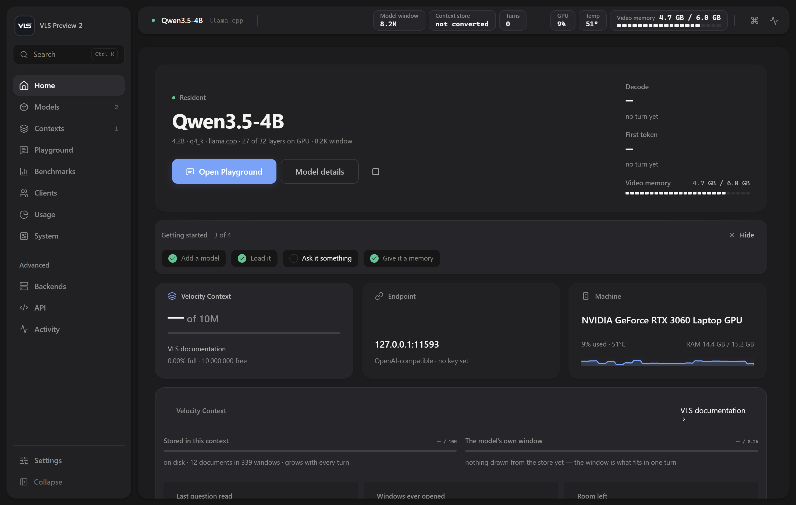
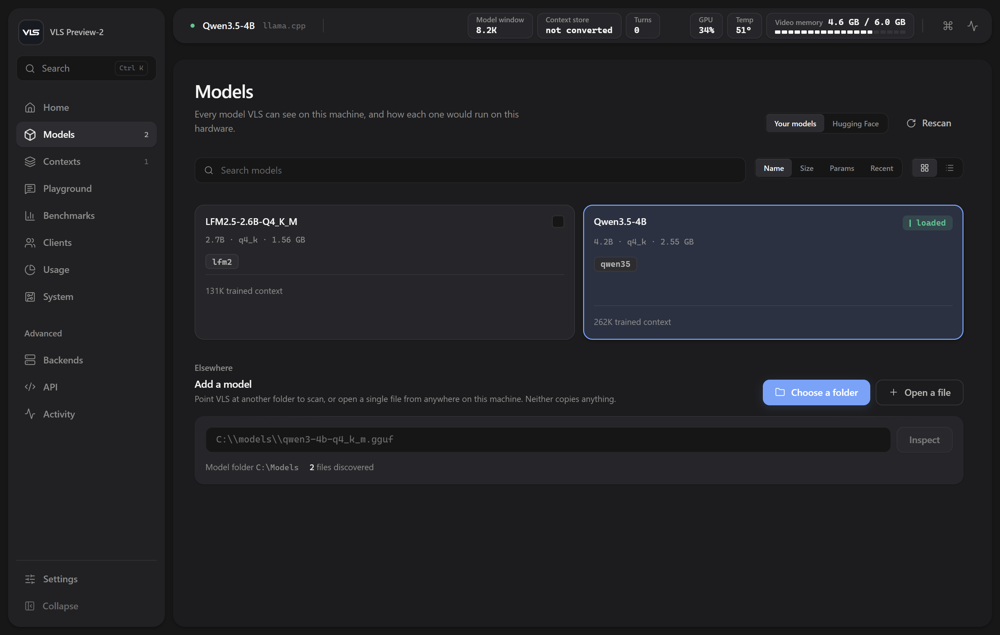
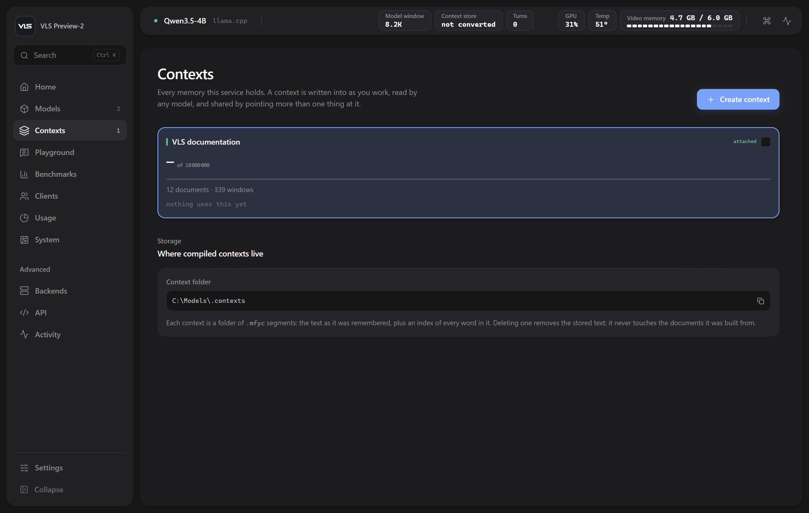
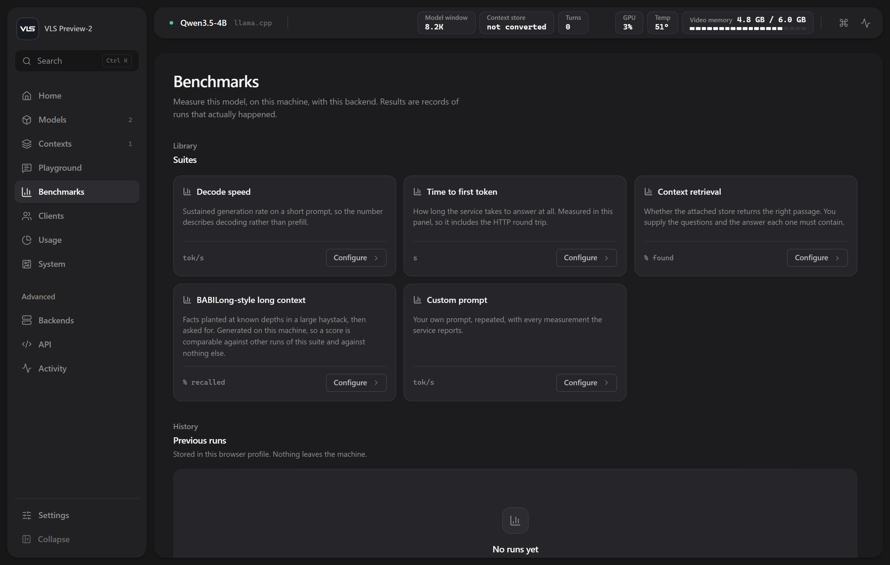
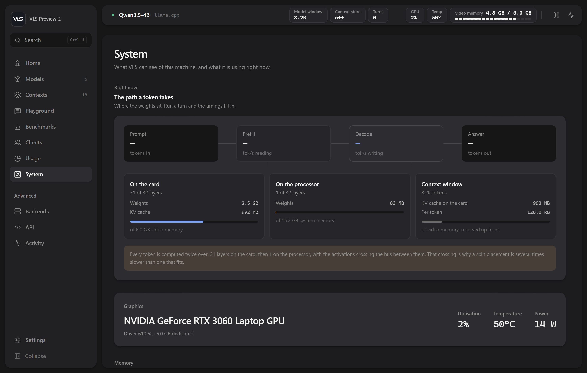

<div align="center">


<h1>VLS</h1>

### Velocity Local Services

<h3>Give any model a 32-million-token memory.<br>On your own machine.</h3>

**One command on Windows. One command on Linux. No cloud, no retraining, no Docker.**

<br>

[](https://github.com/Veloresearch/VLS-Local-LLM-Server/releases/latest)
[](https://github.com/Veloresearch/VLS-Local-LLM-Server/releases)
[](#windows)
[](#linux)
[](LICENSE)

**[veloresearch.com](https://veloresearch.com)** &nbsp;·&nbsp; **[@velo_research](https://x.com/velo_research)** &nbsp;·&nbsp; **[Download](https://github.com/Veloresearch/VLS-Local-LLM-Server/releases/latest)** &nbsp;·&nbsp; **[contact@veloresearch.com](mailto:contact@veloresearch.com)**

<br>



</div>

<br>

## Install

<a name="windows"></a>
**Windows**

```powershell
irm https://github.com/Veloresearch/VLS-Local-LLM-Server/releases/latest/download/install.ps1 | iex
```

<a name="linux"></a>
**Linux**

```bash
curl -fsSL https://github.com/Veloresearch/VLS-Local-LLM-Server/releases/latest/download/install.sh | sh
```

**No administrator. No root. No package manager. No Docker.** Both installers unpack into your own
home directory, check the download against the published SHA-256 before touching anything, and
leave your models untouched on every update.

The panel is then at **http://127.0.0.1:11500/**

<sub>Windows takes the CUDA package if it finds an NVIDIA card and a **25 MB** processor-only
package if it does not. Linux is **17 MB**, processor-only, glibc 2.28 or newer — Debian 10+,
Ubuntu 18.04+, RHEL 8+, and the NAS distributions we have tried.</sub>

<br>

---

## What it is

A local model service with a panel. Give it a GGUF model and, if you like, a folder of your own
documents. It runs the model on your card or your processor, serves an **OpenAI-compatible API** on
`127.0.0.1:11500`, and answers questions out of documents far larger than the model could ever read.

**The unusual part is the memory.** A 4B model reads 8 192 tokens at a time. VLS keeps up to 32
million tokens beside it and, for each question, selects the handful of passages that answer it. The
corpus never enters the model's window — so the context length that matters stops being the
model's, and adding documents costs disk rather than VRAM.

It works on models nobody retrained. Qwen, Llama, Mistral, whatever you already have.

<br>

|  |  |
|---|---|
| 🖥️ **Runs GGUF models** | On the card or the processor, with the placement worked out for *your* hardware before anything loads. |
| 🔎 **Finds models** | Search Hugging Face inside the panel: download size, memory needed **on this machine**, and whether it fits — before you spend twenty minutes on the wrong file. |
| 🧠 **Remembers** | Compile a folder into a context and address millions of tokens. Ask questions across all of it. |
| 🧾 **Shows its working** | Every answer carries a receipt: which passages were selected, how much of the memory reached the model, how long each stage took. |
| 🔌 **Speaks OpenAI** | Point an editor, an agent or your own script at `http://127.0.0.1:11500/v1`. It needs to know nothing about VLS. |
| 📊 **Measures itself** | The benchmarks below, runnable from the panel against your own model and your own memory. |

<br>

---

## The panel

<table>
<tr>
<td width="50%"><br><sub><b>Models</b> — everything on the machine, what each one is, and how it would run here. The Hugging Face store is one switch away.</sub></td>
<td width="50%"><br><sub><b>Contexts</b> — memories compiled from your own documents. Written into as you work, read by any model, shared by pointing more than one thing at them.</sub></td>
</tr>
<tr>
<td width="50%"><br><sub><b>Benchmarks</b> — the numbers below, runnable here against your own model. Numbers you produced beat numbers somebody told you.</sub></td>
<td width="50%"><br><sub><b>System</b> — card, driver, memory, temperature, and a list of checks with what each one found. When a model refuses to load, the reason is usually already here.</sub></td>
</tr>
</table>

<br>

---

## How it is built

VLS is a **router with a memory**, not an inference engine of its own. Work goes to whichever
backend suits the model, and we are explicit about which parts are ours and which are other
people's:

| layer | what it is | whose |
|---|---|---|
| **Velocity Context** | The 32M-token memory: compiles documents, selects the passages a question needs, hands only those to the model. This is what makes a small window stop mattering. | **ours** |
| **[llama.cpp](https://github.com/ggml-org/llama.cpp)** | The GGUF inference engine underneath every model VLS runs today. Georgi Gerganov and the ggml authors, MIT. Preview ships their `llama-server` unmodified. | *theirs* |
| **Velocity / MTA** | Our own execution runtime for `.mfy` artifacts — the research line behind Velocity. Selected automatically for models built for it. | **ours** |
| **[FreeToken](https://github.com/FlashML-org/FreeToken)** | Expert offload for very large MoE models — what makes a 200B-parameter mixture run on a machine that cannot hold it. Apache-2.0. **Planned, not built yet**: today an MoE model routes to llama.cpp. | *theirs* |

Credit where it is owed: without llama.cpp there would be no Preview. VLS adds the memory, the
routing, the hardware fit and the panel — the engine is theirs, and their licence travels inside
every package we ship.

<br>

---

## Velocity Context, measured

Measured on **NVIDIA's RULER** — their harness, cloned, nothing underneath it modified: their
generators, their essays, their scorer. Driven through this service's own API with **Qwen3.5-4B**
on a laptop **RTX 3060** and an **8 192-token model window**. The 128k column is twenty samples a
task: 260 generations, zero nulls, 24.5 minutes.

| RULER task | 4k | 16k | 32k | 64k | 128k |
|---|---:|---:|---:|---:|---:|
| niah_single_1 | 100 | 100 | 100 | 100 | 100 |
| niah_single_2 | 100 | 100 | 100 | 100 | 100 |
| niah_single_3 | 100 | 100 | 100 | 100 | 100 |
| niah_multikey_1 | 100 | 100 | 100 | 100 | 100 |
| niah_multikey_2 | 100 | 20 | 100 | 100 | 100 |
| niah_multikey_3 | 100 | 0 | 40 | 100 | 75.0 |
| niah_multivalue | 100 | 100 | 100 | 100 | 100 |
| niah_multiquery | 100 | 100 | 100 | 100 | 98.8 |
| vt | 100 | 32 | 72 | 60 | 78.0 |
| cwe | 100 | 100 | 100 | 98 | 98.5 |
| fwe | 100 | 100 | 100 | 100 | 100 |
| qa_1 | 100 | 80 | 60 | 60 | 50.0 |
| qa_2 | 100 | 40 | 40 | 40 | 30.0 |
| **13-task average** | **100.0** | **74.8** | **85.5** | **89.1** | **86.9** |

<sub>4k–64k are five samples a cell; 128k is twenty.</sub>

**How to read this, including the parts that do not flatter us.**

The score *rises* from 16k to 64k, which is backwards for a context benchmark and is the shape this
architecture predicts: the model's window is 8 192 tokens either way, so nothing is ever "too long
to read" — what changes is how much material selection has to choose from. The **16k column is the
anomaly, not the 128k one**, and we do not yet know why.

`qa_2` at 30% is the floor and nothing we have tried has moved it. On `qa_1` and `qa_2` selection
delivers the answer and the 4B model fails to convert it — a smaller model reading well is still a
smaller model.

At five samples a cell the 128k average reads **89.6**. At twenty it reads **86.9**. We publish the
second number.

> ### 📄 An article is coming
>
> How the memory is compiled, how selection picks passages, why the corpus never enters the window,
> and every number above reproduced step by step.
>
> **It is not written yet — sorry.** It will be on [veloresearch.com](https://veloresearch.com) and
> announced on [@velo_research](https://x.com/velo_research). Until then, this table and the receipt
> in the panel are the whole of what we are claiming. Nothing here is a number we cannot show you
> how to reproduce.

<br>

---

## Connect anything

VLS speaks the OpenAI protocol, so anything that can talk to OpenAI can talk to it.

```bash
curl http://127.0.0.1:11500/v1/chat/completions \
  -H "content-type: application/json" \
  -d '{"model":"local","messages":[{"role":"user","content":"hello"}]}'
```

```python
from openai import OpenAI

client = OpenAI(base_url="http://127.0.0.1:11500/v1", api_key="not-needed")
print(client.chat.completions.create(
    model="local",
    messages=[{"role": "user", "content": "hello"}],
).choices[0].message.content)
```

The panel's **API** page has the same snippet already filled in with your machine's address and key.

<br>

---

## Where things go

**Windows**

```
%LOCALAPPDATA%\Programs\VLS      the program.  An update replaces it wholesale.
%LOCALAPPDATA%\VLS\models        your models.  An update never touches them.
%LOCALAPPDATA%\VLS\contexts      your memories, likewise.
```

**Linux**

```
~/.local/lib/vls                 the program.  An update replaces it wholesale.
~/.local/share/vls/models        your models.  An update never touches them.
~/.local/share/vls/contexts      your memories, likewise.
```

Updating must never cost you a re-download of models, so the two are kept apart. To remove VLS,
delete the program directory; your models and memories stay until you delete those too.

**Updating:** Settings → Service says whether a newer build exists. VLS reads one small file to find
out and never downloads or replaces anything by itself. The command that updates it is the one that
installed it.

<br>

---

## This is a preview

It is the first build anyone outside Velocity has been able to run, and it behaves like one. There
are rough edges. There are bugs. Some of them are ours to be embarrassed about, and you will
probably find one before we do.

**Please [open an issue](https://github.com/Veloresearch/VLS-Local-LLM-Server/issues) when you do.**
That is what a preview is for, and it is by far the fastest way to get it fixed.

Nothing here sends your data anywhere, so the worst case is a service that annoys you — not one that
costs you something.

<br>

---

## Licence

**Free for personal use. Commercial use requires a licence.**

Use VLS on your own machine, for your own work, study or curiosity, and pay nothing. Use it inside a
business, or to provide a service to somebody else, and you need a commercial licence —
**[contact@veloresearch.com](mailto:contact@veloresearch.com)**.

Full terms: **[LICENSE](LICENSE)** · Third-party components and their licences:
**[THIRD-PARTY-NOTICES.txt](THIRD-PARTY-NOTICES.txt)**

<br>

---

<div align="center">


**Velocity**

**[veloresearch.com](https://veloresearch.com)** &nbsp;·&nbsp; **[@velo_research](https://x.com/velo_research)** &nbsp;·&nbsp; **[contact@veloresearch.com](mailto:contact@veloresearch.com)**

<sub>This repository publishes releases. The source lives elsewhere.</sub>

</div>
