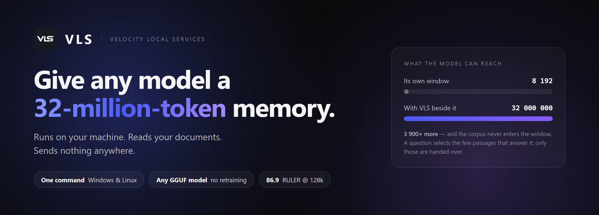

<div align="center">



<br><br>

[](https://github.com/Veloresearch/VLS-32M-Context-Local-LLM/releases/latest)
[](https://github.com/Veloresearch/VLS-32M-Context-Local-LLM/releases)
[](#windows)
[](#linux)
[](LICENSE)
[](https://github.com/Veloresearch/VLS-32M-Context-Local-LLM/stargazers)
[](https://github.com/Veloresearch/VLS-32M-Context-Local-LLM)

**[veloresearch.com](https://veloresearch.com)** &nbsp;·&nbsp; **[@velo_research](https://x.com/velo_research)** &nbsp;·&nbsp; **[Download](https://github.com/Veloresearch/VLS-32M-Context-Local-LLM/releases/latest)** &nbsp;·&nbsp; **[contact@veloresearch.com](mailto:contact@veloresearch.com)**

</div>

<br>

## Install it in one line

<a name="windows"></a>

**Windows** — PowerShell

```powershell
irm https://github.com/Veloresearch/VLS-32M-Context-Local-LLM/releases/latest/download/install.ps1 | iex
```

<a name="linux"></a>

**Linux** — any distribution

```bash
curl -fsSL https://github.com/Veloresearch/VLS-32M-Context-Local-LLM/releases/latest/download/install.sh | sh
```

No administrator. No root. No package manager. No Docker. Both installers unpack into your own home
directory, verify the download against a published SHA-256 before touching anything, and leave your
models alone on every update.

Then open **http://127.0.0.1:11500/**

<sub>Windows takes the CUDA package when it finds an NVIDIA card and a **25 MB** processor-only
package when it does not. Linux is **17 MB**, processor-only, glibc 2.28 or newer — Debian 10+,
Ubuntu 18.04+, RHEL 8+, and the NAS distributions we have tried.</sub>

<br>

<div align="center">

</div>

<br>

---

## The problem it solves

A 4B model reads about **8 000 tokens** at a time. Your documentation is a million. Your codebase is
ten million. Every answer to that today is a compromise: shrink the question, chunk the corpus into
a vector database and hope the right chunk comes back, or rent a bigger model from somebody else's
computer.

**VLS keeps up to 32 million tokens beside the model and hands it only the passages that answer the
question.** The corpus never enters the model's window. Adding documents costs disk, not VRAM. And
it works on a model nobody retrained — Qwen, Llama, Mistral, whatever is already on your drive.

The context length that matters stops being the model's.

<br>

|  |  |
|---|---|
| 🖥️ **Runs GGUF models** | On the card or the processor, with the placement worked out for *your* hardware before anything loads. |
| 🔎 **Finds models** | Search Hugging Face inside the panel: download size, memory needed **on this machine**, and whether it fits — before you spend twenty minutes on the wrong file. |
| 🧠 **Remembers** | Compile a folder into a context and address millions of tokens. Ask questions across all of it. |
| 🧾 **Shows its working** | Every answer carries a receipt: which passages were selected, how much of the memory reached the model, how long each stage took. |
| 🔌 **Speaks OpenAI** | Point an editor, an agent or your own script at `http://127.0.0.1:11500/v1`. It needs to know nothing about VLS. |
| 📊 **Measures itself** | The benchmark below, runnable from the panel against your own model and your own memory. |

<br>

---

## Inside the panel

<table>
<tr>
<td width="50%"></td>
<td width="50%"></td>
</tr>
<tr>
<td width="50%"><b>Models</b><br><sub>Everything on the machine, what each one is, and how it would run <i>here</i>. The Hugging Face store is one switch away, with the fit for your card worked out before you download.</sub></td>
<td width="50%"><b>Contexts</b><br><sub>Memories compiled from your own documents. Written into as you work, readable by any model, shared by pointing more than one thing at the same one.</sub></td>
</tr>
<tr>
<td width="50%"></td>
<td width="50%"></td>
</tr>
<tr>
<td width="50%"><b>Benchmarks</b><br><sub>The numbers below, runnable here against your own model and your own memory. Numbers you produced beat numbers somebody told you.</sub></td>
<td width="50%"><b>System</b><br><sub>Card, driver, memory, temperature, and a list of checks with what each one found. When a model refuses to load, the reason is usually already on this page.</sub></td>
</tr>
</table>

<br>

---

## Measured, not claimed

**NVIDIA's RULER** — their harness, cloned, nothing underneath it modified: their generators, their
essays, their scorer. Driven through this service's own API with **Qwen3.5-4B** on a laptop
**RTX 3060** and an **8 192-token model window**. The 128k column is twenty samples a task: 260
generations, zero nulls, 24.5 minutes.

| RULER task | 4k | 16k | 32k | 64k | 128k |
|---|---:|---:|---:|---:|---:|
| niah_single_1 | 100 | 100 | 100 | 100 | 100 |
| niah_single_2 | 100 | 100 | 100 | 100 | 100 |
| niah_single_3 | 100 | 100 | 100 | 100 | 100 |
| niah_multikey_1 | 100 | 100 | 100 | 100 | 100 |
| niah_multikey_2 | 100 | 20 | 100 | 100 | 100 |
| niah_multikey_3 | 100 | 0 | 40 | 100 | 75.0 |
| niah_multivalue | 100 | 100 | 100 | 100 | 100 |
| niah_multiquery | 100 | 100 | 100 | 100 | 98.8 |
| vt | 100 | 32 | 72 | 60 | 78.0 |
| cwe | 100 | 100 | 100 | 98 | 98.5 |
| fwe | 100 | 100 | 100 | 100 | 100 |
| qa_1 | 100 | 80 | 60 | 60 | 50.0 |
| qa_2 | 100 | 40 | 40 | 40 | 30.0 |
| **13-task average** | **100.0** | **74.8** | **85.5** | **89.1** | **86.9** |

<sub>4k–64k are five samples a cell; 128k is twenty.</sub>

**Read it with the parts that do not flatter us.** The score *rises* from 16k to 64k, which is
backwards for a context benchmark and is the shape this architecture predicts: the model's window is
8 192 tokens either way, so nothing is ever "too long to read" — what changes is how much material
selection has to choose from. The **16k column is the anomaly, not the 128k one**, and we do not yet
know why. `qa_2` at 30% is the floor and nothing we have tried has moved it: on `qa_1` and `qa_2`
selection delivers the answer and the 4B model fails to convert it. At five samples a cell the 128k
average reads **89.6**; at twenty it reads **86.9**, and we publish the second number.

### And beyond, to 32 million

The table above is NVIDIA's harness at the lengths it ships. Past 128k it stops, so the ladder
below is **our own harness** — same task definitions, our haystack, our scorer — run from 1M to 32M
on the same machine and the same 8 192-token window. The two are reported separately and never
averaged together.

| task | 1M | 5M | 10M | 15M | 20M | 25M | 32M |
|---|---:|---:|---:|---:|---:|---:|---:|
| niah_single_1 | 100 | 100 | 100 | 100 | 100 | 100 | 100 |
| niah_single_2 | 100 | 100 | 100 | 100 | 100 | 100 | 100 |
| niah_single_3 | 100 | 100 | 100 | 100 | 100 | 100 | 100 |
| niah_multikey_1 | 100 | 100 | 100 | 100 | 100 | 100 | 100 |
| niah_multivalue | 100 | 100 | 100 | 100 | 100 | 100 | 100 |
| niah_multiquery | 100 | 100 | 100 | 100 | 100 | 100 | 100 |
| cwe | 100 | 100 | 100 | 100 | 100 | 100 | 100 |
| fwe | 100 | 100 | 100 | 100 | 100 | 100 | 100 |
| vt | 80 | 60 | 100 | 80 | 80 | 100 | 100 |
| **nine-task average** | **97.8** | **95.6** | **100** | **97.8** | **97.8** | **100** | **100** |

<sub>Five samples a cell, 315 in the sweep. Qwen3.5-4B-Q4_K_M, 8 192-token window, 32 layers on an
RTX 3060 Laptop 6 GB, thinking off.</sub>

**And the time to answer does not grow with the corpus.**

| corpus | answer, median | answer, p90 | one-time build |
|---|---:|---:|---:|
| 1M | 703 ms | 890 ms | 0.5 s |
| 10M | 570 ms | 1 081 ms | 5.3 s |
| 20M | 708 ms | 1 117 ms | 10.6 s |
| 32M | 653 ms | 1 111 ms | 17.2 s |

Thirty-two times the corpus, the same time to answer, because the model never reads more. Ingestion
runs at about 1.9M tokens a second and is paid once, when the material is written.

**Four things this ladder does not say**, and we would rather say them than have them found:

1. **Five samples a cell.** One sample is 20 points, so a 100% cell is consistent with anything
   from roughly 55% upward at 95% confidence. `vt`'s 60–100% spread is one underlying rate and no
   trend across lengths should be read into it.
2. **Nine of RULER's thirteen tasks** — `niah_multikey_2`, `niah_multikey_3`, `qa_1` and `qa_2` are
   not in this sweep. This average is **not** comparable to a published 13-task RULER average, nor
   to the 128k table above.
3. **Our generator at these lengths.** Same task definitions, our haystack, our scorer. NVIDIA's
   harness does not run here, so this is our measurement of our own work.
4. **Eight of the nine are needle-shaped**, and an inverted index finds a UUID in 32M tokens too. A
   bare score at 32M shows the architecture holds at scale, not that selection beats search. What
   separates the two is `vt` and `cwe` — measured against baselines at 128k, where baselines exist.

> ### 📄 The article is coming
>
> How the memory is compiled, how selection picks passages, why the corpus never enters the window,
> and every number above reproduced step by step.
>
> **It is not written yet — sorry.** It will be at [veloresearch.com](https://veloresearch.com) and
> announced on [@velo_research](https://x.com/velo_research). Until then this table and the receipt
> in the panel are the whole of what we claim. Nothing here is a number we cannot show you how to
> reproduce.

<br>

---

## Built on

VLS is a **router with a memory**, not an inference engine of its own. Work goes to whichever backend
suits the model, and we are explicit about which parts are ours and which are other people's.

| layer | what it is | whose |
|---|---|---|
| **Velocity Context** | The 32M-token memory: compiles documents, selects the passages a question needs, hands only those to the model. This is what makes a small window stop mattering. | **ours** |
| **[llama.cpp](https://github.com/ggml-org/llama.cpp)** | The GGUF inference engine underneath every model VLS runs today. Georgi Gerganov and the ggml authors, MIT. We ship their `llama-server` unmodified. | *theirs* |
| **Velocity / MTA** | Our own execution runtime for `.mfy` artifacts — the research line behind Velocity. Selected automatically for models built for it. | **ours** |

Credit where it is owed: **without llama.cpp there would be no VLS to download.** We add the memory,
the routing, the hardware fit and the panel. The engine is theirs, and their licence travels inside
every package we ship.

<br>

---

## Connect anything

VLS speaks the OpenAI protocol, so anything that already talks to OpenAI talks to it.

```bash
curl http://127.0.0.1:11500/v1/chat/completions \
  -H "content-type: application/json" \
  -d '{"model":"local","messages":[{"role":"user","content":"hello"}]}'
```

```python
from openai import OpenAI

client = OpenAI(base_url="http://127.0.0.1:11500/v1", api_key="not-needed")
print(client.chat.completions.create(
    model="local",
    messages=[{"role": "user", "content": "hello"}],
).choices[0].message.content)
```

The panel's **API** page has the same snippets already filled in with this machine's address and key.

<br>

---

## Where things go

<table>
<tr><td width="50%">

**Windows**

```
%LOCALAPPDATA%\Programs\VLS
%LOCALAPPDATA%\VLS\models
%LOCALAPPDATA%\VLS\contexts
```

</td><td width="50%">

**Linux**

```
~/.local/lib/vls
~/.local/share/vls/models
~/.local/share/vls/contexts
```

</td></tr>
</table>

The first path is the program and an update replaces it wholesale. The other two are yours and an
update never touches them — updating VLS must never cost you a re-download of models. To remove it,
delete the program directory; your models and memories stay until you delete those too.

**Updating:** Settings → Service says whether a newer build exists. VLS reads one small file to find
out and never downloads or replaces anything by itself. The command that updates it is the one that
installed it.

<br>

---

## This is a preview

It is the first build anyone outside Velocity has been able to run, and it behaves like one. There
are rough edges. There are bugs. Some of them are ours to be embarrassed about, and you will
probably find one before we do.

**Please [open an issue](https://github.com/Veloresearch/VLS-32M-Context-Local-LLM/issues) when you do** —
that is what a preview is for, and it is by far the fastest way to get it fixed.

Nothing here sends your data anywhere, so the worst case is a service that annoys you, not one that
costs you something.

<br>

---

## Licence

**Free for personal use. Commercial use requires a licence.**

Use VLS on your own machine, for your own work, study or curiosity, and pay nothing. Use it inside a
business, or to provide a service to somebody else, and you need a commercial licence —
**[contact@veloresearch.com](mailto:contact@veloresearch.com)**.

Full terms: **[LICENSE](LICENSE)** · Third-party components and their licences:
**[THIRD-PARTY-NOTICES.txt](THIRD-PARTY-NOTICES.txt)**

<br>

---

<div align="center">

<br>

### ⭐ Star it if it is useful

It is the whole of our marketing budget, and it is how the next person finds this.

[](https://github.com/Veloresearch/VLS-32M-Context-Local-LLM/stargazers)

<br>

---

<br>


<h3>Velocity</h3>

<b>Local AI that stays local.</b>

<br>

<table>
<tr>
<td align="center" width="33%">
<b>Get it</b><br><br>
<a href="https://github.com/Veloresearch/VLS-32M-Context-Local-LLM/releases/latest">Download</a><br>
<a href="#install-it-in-one-line">Install</a><br>
<a href="https://github.com/Veloresearch/VLS-32M-Context-Local-LLM/releases">All releases</a>
</td>
<td align="center" width="33%">
<b>Talk to us</b><br><br>
<a href="https://github.com/Veloresearch/VLS-32M-Context-Local-LLM/issues">Report a bug</a><br>
<a href="mailto:contact@veloresearch.com">contact@veloresearch.com</a><br>
<a href="https://x.com/velo_research">@velo_research</a>
</td>
<td align="center" width="33%">
<b>Read</b><br><br>
<a href="https://veloresearch.com">veloresearch.com</a><br>
<a href="LICENSE">Licence</a><br>
<a href="THIRD-PARTY-NOTICES.txt">Third-party notices</a>
</td>
</tr>
</table>

<br>

<sub>Built on <a href="https://github.com/ggml-org/llama.cpp">llama.cpp</a> — thank you.</sub>

<sub>© 2026 Velocity · VLS is free for personal use; commercial use requires a licence.</sub>

<sub>This repository publishes releases. The source lives elsewhere.</sub>

</div>
